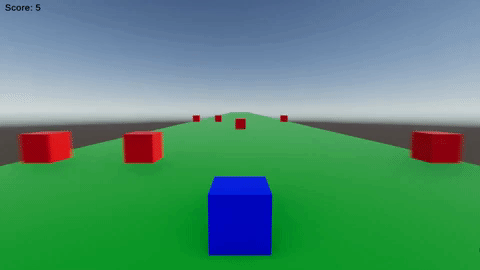

# SpeedCube
Infinite runner game. The player switches lanes to move out of the way of procedurally generated red blocks. Try and get the highest score. Do what you want with the source code.

SpeedCube was developed in Unity, with C#.

# Input
Input in SpeedCube is simple and straightforward.

To Switch Lanes: Tap the left or right side of the screen.  

# GAME RECORDS: 

The current record for highest score is held by: Manjot Mann - 213 - 01/11/2020

# SUBMIT YOUR SCORE:

To submit your own score: 
1. Take a screenshot of the final score with the entire screen fully visible. Cheat codes are not allowed, unless it is a reskin code.
2. Email: westmacgames@gmail.com Include a screenshot, name info, and date. Place them under "Game Records". I will edit and merge if it is legitimate.
